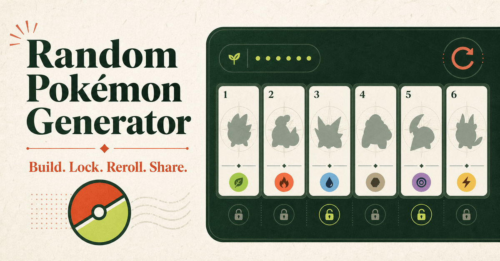

# Random Pokémon Generator

An open-source, mobile-friendly Pokémon picker and team generator covering all 1,025 main species from Generations 1–9.

**Live site:** [randompokemon.xyz](https://randompokemon.xyz)



## Overview

Random Pokémon Generator creates reproducible single picks or teams of up to six Pokémon from a bundled local dataset. It is designed for casual playthroughs, Nuzlocke encounters, monotype runs, drafts, creative prompts, and anyone who wants a fast Pokémon picker without waiting on an API for every roll.

The default experience generates a Smart Team of six. Every result can be refined, locked, rerolled, analyzed, saved locally, and shared through a URL that preserves the complete team state.

## Features

### Generation and filtering

- Generate 1–6 Pokémon with deterministic, human-readable seeds.
- Choose between **Pure Random** and **Smart Team** generation.
- Filter by generation, region, type, evolution stage, base stat total, or fully evolved status.
- Match either any selected type or both types of a dual-type Pokémon.
- Control Legendary, Mythical, Paradox, Ultra Beast, regional, Mega, and Gigantamax eligibility.
- Allow or prevent duplicate team members.
- Use focused presets for starters, Legendary Pokémon, Shiny Pokémon, Nuzlockes, monotype teams, and individual regions.

### Team controls

- Lock selected members and reroll only unlocked slots.
- Reroll or remove one Pokémon without changing the rest of the team.
- Add a random Pokémon to an open slot.
- Toggle normal and Shiny artwork independently for each card.
- View abilities, nature, base stats, type matchups, generation, region, evolution, and category details.
- Analyze type distribution, shared weaknesses, resistances, immunities, and average BST.

### Sharing and persistence

- Recreate the same roll from a seed.
- Share a URL containing the seed, filters, Pokémon, abilities, natures, Shiny state, and locked state.
- Copy a formatted text version of a generated pick or team.
- Keep up to 10 recent generations and 20 favorite teams in browser `localStorage`.
- Use responsive light and dark themes on desktop, tablet, and mobile.

### Additional tools and content

- Searchable Pokédex with 1,025 statically generated detail pages.
- Pokémon comparison, favorite picker, type wheel, and team planner.
- Type, Shiny, Legendary, starter, and regional collections.
- Split XML sitemaps, canonical URLs, structured data, Open Graph metadata, `robots.txt`, and `llms.txt`.

## How Smart Team Works

Pure Random gives every eligible Pokémon an equal chance of selection. Smart Team remains random, but samples multiple valid teams and favors results with:

- more type variety;
- fewer repeated primary types;
- fewer weaknesses shared by four or more members; and
- fewer unevolved Pokémon on the same team.

All active filters are applied before scoring. Smart Team is intended to produce more varied casual teams; it is not a competitive battle simulator or moveset optimizer.

## Tech Stack

- [Next.js](https://nextjs.org/) App Router
- [React](https://react.dev/) and TypeScript
- [Tailwind CSS](https://tailwindcss.com/)
- [Vitest](https://vitest.dev/)
- [`@pkmn/dex`](https://github.com/pkmn/ps) and PokéAPI-derived metadata
- Vercel deployment

## Getting Started

### Requirements

- Node.js 24.x
- npm

### Installation

```bash
git clone <your-repository-url>
cd randompokemon
npm install
cp .env.example .env.local
npm run dev
```

Open [http://localhost:3000](http://localhost:3000) in your browser.

The environment file is optional for local development. The app works without Google Analytics configured.

### Environment variables

| Variable | Required | Description |
| --- | --- | --- |
| `NEXT_PUBLIC_GA_MEASUREMENT_ID` | No | GA4 measurement ID such as `G-XXXXXXXXXX`. Analytics is not loaded when the value is empty or invalid. |

## Available Scripts

| Command | Description |
| --- | --- |
| `npm run dev` | Start the Next.js development server. |
| `npm run build` | Create an optimized production build. |
| `npm run start` | Run the production build locally. |
| `npm run lint` | Run ESLint across the project. |
| `npm test` | Run the complete Vitest suite once. |
| `npm run test:watch` | Run Vitest in watch mode. |
| `npm run data:update` | Rebuild the dataset with fresh PokéAPI metadata. |
| `npm run data:update:offline` | Rebuild battle data while reusing validated local PokéAPI metadata. |

## Pokémon Data

The generated dataset currently contains 1,206 normalized records: 1,025 default species and 181 supported forms. It is written to both:

- `src/data/pokemon.json` for server-side imports and static generation;
- `public/data/pokemon.json` for client-side generator loading.

To refresh it from PokéAPI and the installed `@pkmn/dex` version:

```bash
npm run data:update
```

The update script validates metadata coverage and form quality before replacing either output. Use the offline command when network access is unavailable; it reuses height and category metadata from the existing public dataset.

Sprite URLs are sourced from the PokeAPI sprite repository for default forms and Pokémon Showdown for supported alternate forms.

## Project Structure

```text
app/                         Next.js routes, metadata, and sitemap handlers
src/components/
  generator/                 Generator controls and state
  pokemon/                   Cards, details, directory, and type badges
  team/                      Team analysis UI
  tools/                     Compare, picker, wheel, and planner tools
src/data/                    Pokémon data and curated reference data
src/lib/                     Filtering, randomization, URL state, SEO, and storage
src/types/                   Shared TypeScript models
public/data/pokemon.json     Browser-ready Pokémon dataset
scripts/fetch-pokemon-data.ts
tests/                       Vitest unit and integration-style tests
```

The `@/` import alias maps to `src/`.

## Validation

Run the standard checks before submitting a change:

```bash
npm run lint
npm test
npm run build
```

The test suite covers dataset quality, page defaults, filters, deterministic random generation, URL-state round trips, type calculations, team analysis, static generation, canonical rules, and sitemap output.

## Deployment

The repository includes `vercel.json` and can be deployed directly to Vercel. For another Node.js host, install dependencies, run `npm run build`, and serve the result with `npm run start`. Add `NEXT_PUBLIC_GA_MEASUREMENT_ID` in the deployment environment only if GA4 tracking is wanted.

## Data and Browser Behavior

- Generation runs against the bundled dataset after it is loaded by the browser.
- Recent generations and favorites stay in that browser's `localStorage`; there is no account sync.
- Share URLs encode team state, so review the URL before sharing if you consider a custom seed private.
- Clearing site storage removes saved recent generations and favorites.

## Disclaimer

RandomPokemon.xyz is an independent, unofficial fan-made project. Pokémon and Pokémon character names are trademarks of Nintendo, Game Freak, Creatures Inc., and The Pokémon Company. This project is not affiliated with or endorsed by those companies.
